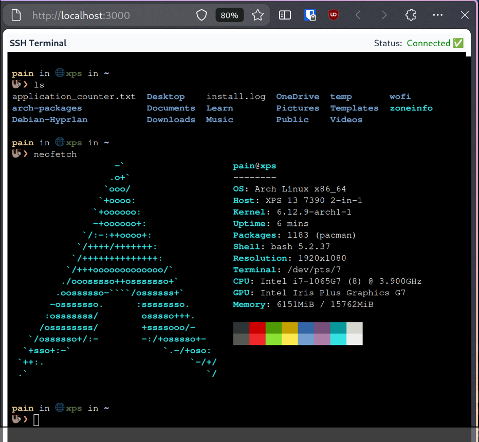
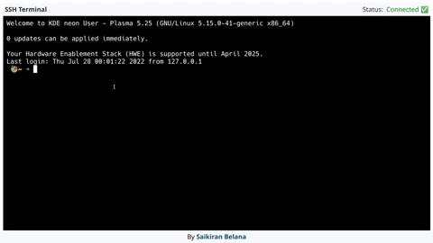

#  Web Terminal

> Web Terminal Using [xTerm](https://www.npmjs.com/package/xterm), [SSH2](https://www.npmjs.com/package/ssh2) & [Socket.io](https://socket.io/)


**Built on**:

- NodeJs 
- BackEnd & ReactJs
- FrontEnd

​


## Clone Project:
```
git clone https://github.com/belanasaikiran/Web-Terminal.git
```


You can fork it and use it for your projects.

I've added a `.env` file so that you can use it to modify according to your device credentials 🔑


> Please make sure you have `openssh` installed locally and have setup the config file.

Arch linux: 
```bash
sudo pacman -S openssh
```

Ubuntu:
```bash
sudo apt-get install openssh
```


### Install Dependencies :

```bash
cd Web-Terminal
npm install

cd client
npm install
```

### Run the Project:

```bash
npm run dev
```

> Needs ports 3000 and 5000 to be free.

### Working Sample:



Any Contributions are always welcome 🤗 …


### Future Changes/Releases
- Build an Electron app for a unified version.
- Save multiple configs using SQLite


